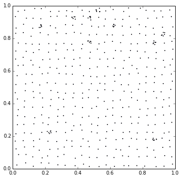
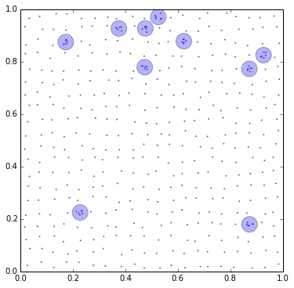

Abnormal Group Mining Demo
==========================

.. code:: python

    %pylab inline

.. parsed-literal::

    Populating the interactive namespace from numpy and matplotlib

.. code:: python

    import numpy as np
    from matplotlib import pyplot as plt
    from matplotlib.patches import Circle
    from scipy.spatial import distance

.. code:: python

    def generate_dataset(n=20, k=5, num_of_ag=10):
        # 将(0,1)x(0,1)划分成nxn个小格子，在格子的靠近中心位置生成一个点
        X = np.empty((n*n + num_of_ag*k, 2))
        X_1 = np.random.rand(n, n) * .5 + .25
        X_2 = np.random.rand(n, n) * .5 + .25
        ma, mb = np.meshgrid(xrange(n), xrange(n))
        ma = ma / float(n)
        mb = mb / float(n)
        X[:n*n, 0] = (X_1/n + ma).flatten()
        X[:n*n, 1] = (X_2/n + mb).flatten()
        # 生成num_of_ag特异群组点，每组含k个点
        for i in xrange(num_of_ag):
            X[n*n+i*k:n*n+(i+1)*k, :] = (np.random.rand(k, 2)*.5 + .25 
                                         + np.random.randint(0, n, size=(2,)))/n 
            
        return X
    
    np.random.seed(0)
    X = generate_dataset(20, 5, 10)
    fig = plt.figure(figsize=(6,6))
    ax = fig.add_subplot(111)
    ax.scatter(X[:, 0], X[:, 1], s=1, alpha=1)
    ax.set_xlim(0, 1)
    ax.set_ylim(0, 1)

.. parsed-literal::

    (0, 1)

.. code:: python

    def find_abnormal(X, threshold, updatecenter, metric='euclidean', maxiters=100):
        # Initiate centers
        centers = X[0, :][None, :]  # 初始中心只有一个即第一个样本
        backup = centers.copy() - 1  # 用来记录上一步的结果，判断是否收敛
        k = 0
        labels = np.zeros(len(X), dtype=int) # 每个样本所属类别
        loops = 0
        # interate until converged
        while len(backup) != len(centers) or not np.allclose(backup, centers):
            loops += 1
            backup = centers.copy()
            # 每一轮迭代都要遍历所有的点
            for i in xrange(len(X)):
                x = X[i, :]
                dis = distance.cdist([x], centers, metric=metric)[0]  # 计算与各中心的距离
                pos = dis.argmin()
                if dis[pos] > threshold:  # 如果最小的距离也大于阈值，则新建一个中心
                    centers = np.concatenate((centers, x[None, :]))
                    k += 1
                    labels[i] = k
                else:  # 否则将这个点划到最近的中心点
                    labels[i] = pos
            centers = updatecenter(X, centers, labels, k)  # 每轮最后都要更新中心点
            if loops > maxiters:
                break
        print 'iteration: %3d' % loops
        return centers, labels
        
    def update_in_R2(X, centers, labels, k):
        # 这里的更新中心点只是简单的取均值
        count = np.zeros(k+1)
        centers_sum = np.zeros((k+1, 2))
        for i in xrange(len(X)):
            z = labels[i]
            count[z] += 1
            centers_sum[z, :] += X[i, :]
        return centers_sum / count[:, None]

.. code:: python

    def plot_in_R2(X, centers, labels, radius, minpts=2):
        # 最后大多数簇中只含有1个点，那么含有多于minpts个点的即为特异群组
        count = np.bincount(labels)
        ind = np.where(count >= minpts)[0]
        print 'Found %3d abnormal groups' % len(ind)
        print 'Number of pts in abnormal groups:\n %s' % count[ind]
        fig = plt.figure(figsize=(6,6))
        ax = fig.add_subplot(111)
        ax.scatter(X[:,0], X[:,1], s=1, alpha=.5)
        for k in ind:
            cir = Circle(xy=tuple(centers[k]), radius=radius, alpha=.3)
            ax.add_patch(cir)
        plt.xlim(0, 1)
        plt.ylim(0, 1)

.. code:: python

    radius  = .03
    centers, labels = find_abnormal(X, radius, update_in_R2)
    plot_in_R2(X, centers, labels, radius, 3)

.. parsed-literal::

    iteration:   2
    Found  10 abnormal groups
    Number of pts in abnormal groups:
     [6 6 6 6 6 6 6 6 6 6]

